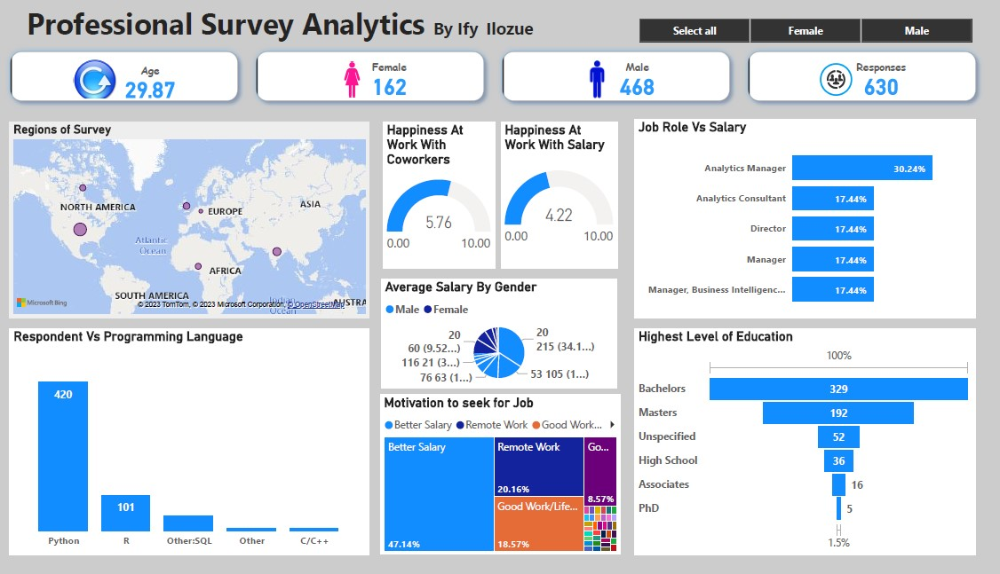

# Professional Data Survey
Data has emerged as the fundamental pillar of innovation and advancement. this stands as the driving catalyst behind well-informed choices, pioneering breakthroughs, and revolutionary technologies. 
This dataset encompasses a survey conducted among professionals in the field of data to gather insights regarding their perspectives and opinions about the profession. 
The ETL methodology was employed to Extract, Load, and Transform data within Power BI, simplifying intricate technical data into easily understandable narratives tailored for non-technical stakeholders. 
The global HR department conducted a survey spanning all regions, with a total of 630 respondents, comprising 468 males and females, and an average age of 29.87. 

  

# Main Insights:

   In the survey of professionals, Python, R, and SQL stood out as the top-rated programming languages, garnering 381, 150, and 10 endorsements, respectively.  
   This trend underscores the increasing need for data-driven expertise. 
  📌   An astounding 47.14% underscores the significant role financial stability and advancement play in of respondents in the survey cited "Higher Salary" as their primary motivation for pursuing new job opportunities. Meanwhile, 20.16% of participants prioritized "Remote Work," highlighting the growing attraction of flexibility, while closely following behind, 24% emphasized the importance of "Work-Life Balance," signifying its increasing relevance in recent times. 
 📌    Average salary by sex: Male and total Female are positively correlated with each other. Male and Female diverged the most when the Salary was 20, when Male were 155 higher than Female. 
  📌  Analytics Manager had the highest Average Salary at 326 (30.24%), followed by Analytics Consultant and Manager, Business Intelligence Develop, which tied for second at 188. Analytics Manager topped the Job Title list with 381 (60.4%) of the sample. 
   📌  Highest Level of Education: Bachelors topped the list at 52.22% followed by Masters with 30.48%  

In summary, organizations must acknowledge that the primary factors motivating job seekers are improved compensation, remote work opportunities, and achieving a work-life balance. 
As organizations progressively leverage data for informed talent management, proficiency in these languages has evolved into a valuable asset. This proficiency enables professionals to extract insights, enhance processes, and facilitate strategic workforce planning. 
Diverse opinions regarding the challenges of entering the data industry underscore its dynamic and evolving nature. Individual experiences significantly shape the journey into this exciting field. 

